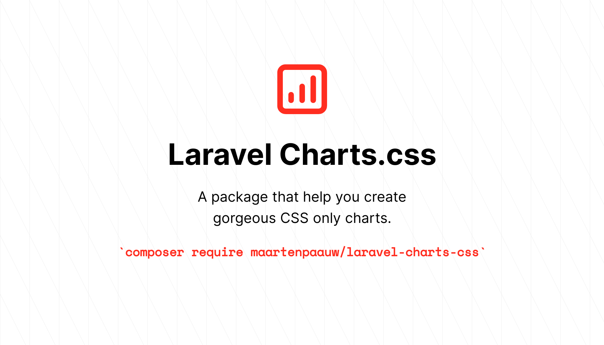

# Laravel component to create gorgeous Charts.css charts.

[](https://packagist.org/packages/maartenpaauw/laravel-charts-css)
[](https://github.com/maartenpaauw/laravel-charts-css/actions?query=workflow%3Arun-tests+branch%3Amain)
[](https://github.com/maartenpaauw/laravel-charts-css/actions?query=workflow%3A"Check+%26+fix+styling"+branch%3Amain)
[](https://packagist.org/packages/maartenpaauw/laravel-charts-css)

This package will help you generate CSS only charts based on the [**Charts.css**](https://chartscss.org/) library.

## Installation

You can install the package via composer:

```bash
composer require maartenpaauw/laravel-charts-css
```

## Usage

Here's how you can create a chart:

```bash
php artisan make:chart MedalsChart
```

This will generate a chart component within the `View/Components` namespace.

```php
<?php

namespace DummyNamespace;

use Maartenpaauw\Chartscss\Chart;
use Maartenpaauw\Chartscss\Data\Axes\Axes;
use Maartenpaauw\Chartscss\Data\Datasets\Dataset;
use Maartenpaauw\Chartscss\Data\Datasets\Datasets;
use Maartenpaauw\Chartscss\Data\Datasets\DatasetsContract;
use Maartenpaauw\Chartscss\Data\Entries\Entry;
use Maartenpaauw\Chartscss\Data\Entries\Value\Value;
use Maartenpaauw\Chartscss\Data\Label\Label;

class MedalsChart extends Chart
{
    protected function id(): string
    {
        return 'medals-chart';
    }

    protected function heading(): string
    {
        return __('Medals Chart');
    }

    protected function datasets(): DatasetsContract
    {
        return new Datasets(
            new Axes('Country', ['Gold', 'Silver', 'Bronze']),
            new Dataset([
                new Entry(new Value(46)),
                new Entry(new Value(37)),
                new Entry(new Value(38)),
            ], new Label('USA')),
            new Dataset([
                new Entry(new Value(27)),
                new Entry(new Value(23)),
                new Entry(new Value(17)),
            ], new Label('GBR')),
            new Dataset([
                new Entry(new Value(26)),
                new Entry(new Value(18)),
                new Entry(new Value(26)),
            ], new Label('CHN')),
        );
    }
}
```

To display your chart it is as easily as adding the following blade component:

```html
<x-medals-chart/>
```

Make sure you import the css library as well. There is a helper component available for it!

```html
<x-charts-css-stylesheet cdn="unpkg" />
```

## Advanced

See all Charts.css documentation examples within the `src/Examples` directory or read all the advanced documentation below to learn more. 

### Tooltips

It is possible to configure a tooltip for each entry like this:

```php
use Maartenpaauw\Chartscss\Data\Axes\Axes;
use Maartenpaauw\Chartscss\Data\Datasets\Dataset;
use Maartenpaauw\Chartscss\Data\Datasets\Datasets;
use Maartenpaauw\Chartscss\Data\Datasets\DatasetsContract;
use Maartenpaauw\Chartscss\Data\Entries\Entry;
use Maartenpaauw\Chartscss\Data\Entries\Tooltip\Tooltip;
use Maartenpaauw\Chartscss\Data\Entries\Value\Value;
use Maartenpaauw\Chartscss\Data\Label\Label;

// ...

protected function datasets(): DatasetsContract
{
    return new Datasets(
        new Axes('Type', 'Amount'),
        new Dataset([
            new Entry(
                new Value(46),
                new Label('Gold'),
                new Tooltip('46 gold medals!'), // <--
            ),
            new Entry(
                new Value(37),
                new Label('Silver'),
                new Tooltip('37 silver medals!'), // <--
            ),
            new Entry(
                new Value(38),
                new Label('Bronze'),
                new Tooltip('38 bronze medals!'), // <--
            ),
        ]),
    );
}
```

### Single dataset

The default generated chart component shows you how you can provide multiple datasets.
If you only want to show a single dataset, you still need to wrap in within a datasets instance.
This is because axes must be provided. The only difference is you need to provide the data axis via the entry
and give a global description via the axes.

```php
use Maartenpaauw\Chartscss\Data\Axes\Axes;
use Maartenpaauw\Chartscss\Data\Datasets\Dataset;
use Maartenpaauw\Chartscss\Data\Datasets\Datasets;
use Maartenpaauw\Chartscss\Data\Datasets\DatasetsContract;
use Maartenpaauw\Chartscss\Data\Entries\Entry;
use Maartenpaauw\Chartscss\Data\Entries\Value\Value;
use Maartenpaauw\Chartscss\Data\Label\Label;

// ...

protected function datasets(): DatasetsContract
{
    return new Datasets(
        new Axes('Type', 'Amount'),
        new Dataset([
            new Entry(new Value(46), new Label('Gold')),
            new Entry(new Value(37), new Label('Silver')),
            new Entry(new Value(38), new Label('Bronze')),
        ]),
    );
}
```

#### Hiding a specific label

```php
use Maartenpaauw\Chartscss\Data\Axes\Axes;
use Maartenpaauw\Chartscss\Data\Datasets\Dataset;
use Maartenpaauw\Chartscss\Data\Datasets\Datasets;
use Maartenpaauw\Chartscss\Data\Datasets\DatasetsContract;
use Maartenpaauw\Chartscss\Data\Entries\Entry;
use Maartenpaauw\Chartscss\Data\Entries\Value\Value;
use Maartenpaauw\Chartscss\Data\Label\Label;

// ...

protected function datasets(): DatasetsContract
{
    return new Datasets(
        new Axes('Type', 'Amount'),
        new Dataset([
            (new Entry(new Value(46), new Label('Gold')))
                ->hideLabel(), // <--
            new Entry(new Value(37), new Label('Silver')),
            new Entry(new Value(38), new Label('Bronze')),
        ]),
    );
}
```

You can hide an entry's label by calling the `hideLabel()` method on a dataset.

#### Alignment of a specific label

```php
use Maartenpaauw\Chartscss\Data\Axes\Axes;
use Maartenpaauw\Chartscss\Data\Datasets\Dataset;
use Maartenpaauw\Chartscss\Data\Datasets\Datasets;
use Maartenpaauw\Chartscss\Data\Datasets\DatasetsContract;
use Maartenpaauw\Chartscss\Data\Entries\Entry;
use Maartenpaauw\Chartscss\Data\Entries\Value\Value;
use Maartenpaauw\Chartscss\Data\Label\Label;

// ...

protected function datasets(): DatasetsContract
{
    return new Datasets(
        new Axes('Type', 'Amount'),
        new Dataset([
            (new Entry(new Value(46), new Label('Gold')))
                ->alignLabel('end'), // <--
            new Entry(new Value(37), new Label('Silver')),
            new Entry(new Value(38), new Label('Bronze')),
        ]),
    );
}
```

You can align an entry's label by calling the `alignLabel()` method on a dataset with `start`, `center` or `end` as parameter.

### Multiple datasets

#### Hiding a specific label

```php
use Maartenpaauw\Chartscss\Data\Axes\Axes;
use Maartenpaauw\Chartscss\Data\Datasets\Dataset;
use Maartenpaauw\Chartscss\Data\Datasets\Datasets;
use Maartenpaauw\Chartscss\Data\Datasets\DatasetsContract;
use Maartenpaauw\Chartscss\Data\Entries\Entry;
use Maartenpaauw\Chartscss\Data\Entries\Value\Value;
use Maartenpaauw\Chartscss\Data\Label\Label;

// ...

protected function datasets(): DatasetsContract
{
    return new Datasets(
        new Axes('Country', ['Gold', 'Silver', 'Bronze']),
        (new Dataset([
            new Entry(new Value(46)),
            new Entry(new Value(37)),
            new Entry(new Value(38)),
        ], new Label('USA')))
            ->hideLabel(), // <--
        new Dataset([
            new Entry(new Value(27)),
            new Entry(new Value(23)),
            new Entry(new Value(17)),
        ], new Label('GBR')),
    );
}
```

You can hide a dataset's label by calling the `hideLabel()` method on a dataset.

#### Hiding a specific label

```php
use Maartenpaauw\Chartscss\Data\Axes\Axes;
use Maartenpaauw\Chartscss\Data\Datasets\Dataset;
use Maartenpaauw\Chartscss\Data\Datasets\Datasets;
use Maartenpaauw\Chartscss\Data\Datasets\DatasetsContract;
use Maartenpaauw\Chartscss\Data\Entries\Entry;
use Maartenpaauw\Chartscss\Data\Entries\Value\Value;
use Maartenpaauw\Chartscss\Data\Label\Label;

// ...

protected function datasets(): DatasetsContract
{
    return new Datasets(
        new Axes('Country', ['Gold', 'Silver', 'Bronze']),
        (new Dataset([
            new Entry(new Value(46)),
            new Entry(new Value(37)),
            new Entry(new Value(38)),
        ], new Label('USA')))
            ->alignLabel('end'), // <--
        new Dataset([
            new Entry(new Value(27)),
            new Entry(new Value(23)),
            new Entry(new Value(17)),
        ], new Label('GBR')),
    );
}
```

You can align a dataset's label by calling the `alignLabel()` method on a dataset with `start`, `center` or `end` as parameter.

### Stylesheet

> **Warning!** Make sure you insert this component within your base layout template where your chart is not directly used.
> Otherwise a custom defined colorscheme won't be pushed to the CSS stack.

```html
<x-charts-css-stylesheet cdn="unpkg" />
```

Charts.css host the production CSS file on two difference CDN's: `jsdelivr` and `unpkg`.
You can import the stylesheet by adding the following component to the head within your blade file.

If you add your CSS by using a different way, for example a package manager, you can leave out the `cdn` attribute. 
Then this component will only be used to render the colorscheme definitions.

### Type

```php
use Maartenpaauw\Chartscss\Types\Bar;
use Maartenpaauw\Chartscss\Types\ChartType;

// ...

protected function type(): ChartType
{
    return new Bar();
}
```

At the moment there is support for 4 types of charts:

- `Area`
- `Bar`
- `Column`
- `Line`

By default each generated chart is a `Column` chart. If you want to change the chart type you can do it by overwriting the `type` method.

When using an `area` or `line` chart, you must determine the start of the chart by calling the `start` method on the first
entry like this:

```php
use Maartenpaauw\Chartscss\Data\Axes\Axes;
use Maartenpaauw\Chartscss\Data\Datasets\Dataset;
use Maartenpaauw\Chartscss\Data\Datasets\Datasets;
use Maartenpaauw\Chartscss\Data\Datasets\DatasetsContract;
use Maartenpaauw\Chartscss\Data\Entries\Entry;
use Maartenpaauw\Chartscss\Data\Entries\Value\Value;
use Maartenpaauw\Chartscss\Data\Label\Label;

// ...

protected function datasets(): DatasetsContract
{
    return new Datasets(
        new Axes('Type', 'Amount'),
        new Dataset([
            (new Entry(new Value(46), new Label('Gold')))
                ->start(10),
            new Entry(new Value(37), new Label('Silver')),
            new Entry(new Value(38), new Label('Bronze')),
        ]),
    );
}
```

### Legend

```php
use Maartenpaauw\Chartscss\Legend\Legend;

// ...

protected function legend(): Legend
{
    return parent::legend()
        ->withLabel('Gold')
        ->withLabels(['Silver', 'Bronze'])
        ->inline()
        ->ordered()
        ->squares();
}
```

By default, no legend is being generated and shown. You can change this behaviour by simply overwriting the `legend()` method.
By calling the `withLabel()` or `withLabels()` method on a `Legend` instance you can add a label.
By default, the legend is displayed vertically. You can change it to horizontally by chaining the `inline()` method.

The labels do not have any style by default. You can change the shape by calling one of the following methods:

- `circles()`
- `ellipses()`
- `lines()`
- `rectangles()`
- `rhombuses()`
- `squares()`

By default the HTML tag `ul` is used to display the legend on the screen. If you prefer an `ol` HTML tag chain the
`ordered()` method.

### Colorscheme

> **Warning!** Do not forget to add the `<x-charts-css-stylesheet />` to your layout's head.

```php
use Maartenpaauw\Chartscss\Appearance\Colorscheme\Color;
use Maartenpaauw\Chartscss\Appearance\Colorscheme\ColorschemeContract;

// ...

protected function colorscheme(): ColorschemeContract
{
    return parent::colorscheme()
        ->add(new Color('#FF0000'))
        ->add(new Color('#00FF00'))
        ->add(new Color('#0000FF'));
}
```

The framework has a set of 10 default color repeating themselves.
You can change it by overwriting the `colorscheme()` method.

If you only add one color, **all** the data entries will get the same color.
You can add up to 10 colors by calling the `add()` method on the colorscheme.

```php
use Maartenpaauw\Chartscss\Appearance\Colorscheme\Color;
use Maartenpaauw\Chartscss\Appearance\Colorscheme\ColorschemeContract;

// ...

protected function colorscheme(): ColorschemeContract
{
    return new Colorscheme([
        new Color('#FF0000'),
        new Color('#00FF00'),
        new Color('#0000FF'),
    ]);
}
```

It is also possible to return a new instance of `Colorscheme` and given an array with colors as the first constructor parameter.

#### Specific color for one entry

```php
use Maartenpaauw\Chartscss\Appearance\Colorscheme\Color;
use Maartenpaauw\Chartscss\Data\Axes\Axes;
use Maartenpaauw\Chartscss\Data\Datasets\Dataset;
use Maartenpaauw\Chartscss\Data\Datasets\Datasets;
use Maartenpaauw\Chartscss\Data\Datasets\DatasetsContract;
use Maartenpaauw\Chartscss\Data\Entries\Entry;
use Maartenpaauw\Chartscss\Data\Entries\Value\Value;
use Maartenpaauw\Chartscss\Data\Label\Label;

// ...

protected function datasets(): DatasetsContract
{
    return new Datasets(
        new Axes('Type', 'Amount'),
        new Dataset([
            (new Entry(new Value(46), new Label('Gold')))
                ->color(new Color('#FFD700')), // <--
            new Entry(new Value(37), new Label('Silver')),
            new Entry(new Value(38), new Label('Bronze')),
        ]),
    );
}
```

Want to change a specific data entry's color? This can be done by chaining the `color` method.

### Modifications

By overwriting the `modifications()` method you can add multiple modifications.

Out of the box the `ShowHeading` modification will be applied when the heading is present
and the modifications `Multiple` and `ShowLabels` are applied when there are multiple datasets configured.

All modifications can be found within the `Maartenpaauw\Chartscss\Appearance` namespace.

#### Data(sets) spacing

```php
use Maartenpaauw\Chartscss\Appearance\DatasetsSpacing;
use Maartenpaauw\Chartscss\Appearance\DataSpacing;
use Maartenpaauw\Chartscss\Appearance\Modifications;

// ...

protected function modifications(): Modifications
{
    return parent::modifications()
        ->add(new DataSpacing(10))
        ->add(new DatasetsSpacing(20));
}
```

By adding `DatasetsSpacing` or `DataSpacing` you can configure the space between the data entries. Both constructors accept a number between 1 and 20 defining the amount of space.

#### Hide data

```php
use Maartenpaauw\Chartscss\Appearance\HideData;
use Maartenpaauw\Chartscss\Appearance\Modifications;

// ...

protected function modifications(): Modifications
{
    return parent::modifications()
        ->add(new HideData());
}
```

The `HideData` modification will hide the display value of each entry.
The value will still be printed to the screen, but it is hidden by CSS.
This will respect screenreaders.

#### Show data on hover

```php
use Maartenpaauw\Chartscss\Appearance\Modifications;
use Maartenpaauw\Chartscss\Appearance\ShowDataOnHover;

// ...

protected function modifications(): Modifications
{
    return parent::modifications()
        ->add(new ShowDataOnHover());
}
```

The `ShowDataOnHover` modification will hide the data the same way as the `HideData` modification.
The big difference is it will show the data when you hover it.

#### Label alignment

```php
use Maartenpaauw\Chartscss\Appearance\LabelsAlignCenter;
use Maartenpaauw\Chartscss\Appearance\LabelsAlignEnd;
use Maartenpaauw\Chartscss\Appearance\LabelsAlignStart;
use Maartenpaauw\Chartscss\Appearance\Modifications;

// ...

protected function modifications(): Modifications
{
    return parent::modifications()
        ->add(new LabelsAlignStart())
        ->add(new LabelsAlignCenter())
        ->add(new LabelsAlignEnd());
}
```

You can configure the label alignment by adding one of the following modifications: `LabelsAlignStart`, `LabelsAlignCenter` or `LabelsAlignRight`.

#### Multiple

```php
use Maartenpaauw\Chartscss\Appearance\Modifications;
use Maartenpaauw\Chartscss\Appearance\Multiple;

// ...

protected function modifications(): Modifications
{
    return parent::modifications()
        ->add(new Multiple());
}
````

When displaying multiple datasets the modification `Multiple` needs to be added.
Out of the box it is automatically added if there are multiple datasets.

#### Reverse

```php
use Maartenpaauw\Chartscss\Appearance\Modifications;
use Maartenpaauw\Chartscss\Appearance\ReverseData;
use Maartenpaauw\Chartscss\Appearance\ReverseDatasets;
use Maartenpaauw\Chartscss\Appearance\ReverseOrientation;

// ...

protected function modifications(): Modifications
{
    return parent::modifications()
        ->add(new ReverseData())
        ->add(new ReverseDatasets())
        ->add(new ReverseOrientation());
}
```

If you want to reverse the data, datasets or the orientation you can add the modifications:
`ReverseData`, `ReverseDatasets` or/and `ReverseOrientation`.

#### Axes

```php
use Maartenpaauw\Chartscss\Appearance\Modifications;
use Maartenpaauw\Chartscss\Appearance\ShowDataAxes;
use Maartenpaauw\Chartscss\Appearance\ShowPrimaryAxis;
use Maartenpaauw\Chartscss\Appearance\ShowSecondaryAxes;

// ...

protected function modifications(): Modifications
{
    return parent::modifications()
        ->add(new ShowDataAxes())
        ->add(new ShowPrimaryAxis())
        ->add(new ShowSecondaryAxes());
}
```

By default, no axes are shown. You can show the primary axis by adding the `ShowPrimaryAxis`.
Same goes for the `ShowDataAxes`.

To display the secondary axes you can add the `ShowSecondaryAxes` modification.
The constructor accepts the amount of axes (with a limit of 10) as the first parameter.

#### Show heading

```php
use Maartenpaauw\Chartscss\Appearance\Modifications;
use Maartenpaauw\Chartscss\Appearance\ShowHeading;

// ...

protected function modifications(): Modifications
{
    return parent::modifications()
        ->add(new ShowHeading());
}
````

The heading (table caption) will always be printed to the screen to respect screenreaders,
but it will be hidden with CSS by default. If you want to display the heading you need to add the `ShowHeading` modification.
This modification will be added automatically when the heading is present.

#### Show labels

```php
use Maartenpaauw\Chartscss\Appearance\Modifications;
use Maartenpaauw\Chartscss\Appearance\ShowLabels;

// ...

protected function modifications(): Modifications
{
    return parent::modifications()
        ->add(new ShowLabels());
}
````

The labels will always be printed to the screen to respect screenreaders,
but they are hidden with CSS by default. If you want to display the labels you need to add the `ShowLabels` modification.

#### Stacked

```php
use Maartenpaauw\Chartscss\Appearance\Modifications;
use Maartenpaauw\Chartscss\Appearance\Stacked;

// ...

protected function modifications(): Modifications
{
    return parent::modifications()
        ->add(new Stacked());
}
````

If you want to stack multiple datasets you can add the `Stacked` modification.

#### Did I miss adding a modification?

```php
use Maartenpaauw\Chartscss\Appearance\CustomModification;
use Maartenpaauw\Chartscss\Appearance\Modifications;

// ...

protected function modifications(): Modifications
{
    return parent::modifications()
        ->add(new CustomModification('foo'));
}
````

Feel free to create a pull request or submitting an issue.
In the meanwhile you can add it easily by adding a `CustomModification`.

### Configuration

As mentioned before, the configuration is pretty smart. It adds a `ShowHeading` modification if a heading is present,
adds the modifications `Multiple` when multiple datasets are present, it adds the `ShowLabels` modification when there
are dataset or entry labels defined, and it uses the configured data axes as legend labels when none has been specified.

This is done by wrapping the configuration within a `SmartConfiguration` decorator. If you do not want this behaviour
you can overwrite the `configuration` method and build the configuration by yourself.

```php
use Maartenpaauw\Chartscss\Configuration\Configuration;
use Maartenpaauw\Chartscss\Configuration\ConfigurationContract;

// ...

protected function configuration(): ConfigurationContract
{
    return new Configuration(
        $this->identity(),
        $this->legend(),
        $this->modifications(),
        $this->colorscheme(),
    );
}
````

### Wrapper div

If a legend is configured the chart will be wrapped in a `div`. If you want to change the HTML tag you can overwrite the
`tag()` method.

```php
// ...

protected function tag(): string
{
    return 'article';
}
```

## Testing

```bash
composer test
```

## Changelog

Please see [CHANGELOG](CHANGELOG.md) for more information on what has changed recently.

## Contributing

Please see [CONTRIBUTING](.github/CONTRIBUTING.md) for details.

## Security Vulnerabilities

Please review [our security policy](../../security/policy) on how to report security vulnerabilities.

## Credits

- [Maarten Paauw](https://github.com/maartenpaauw)
- [All Contributors](../../contributors)

## License

The MIT License (MIT). Please see [License File](LICENSE.md) for more information.
